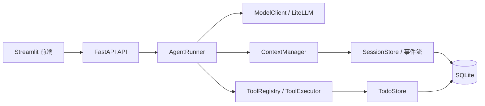

# Tiny Agent

[English](README.md) | 中文

Tiny Agent（`tia`）是一个小型、模型供应商无关的 Agent 框架与运行时。项目聚焦于最核心、
最容易理解和验证的 Agent 能力：模型决策、工具调用、Session 隔离、Memory 持久化、Context
管理、执行限制和可观测事件。

项目自行实现 Agent Loop 和核心运行时，控制流保持显式、紧凑并且可测试。核心技术栈由项目内
Python 模块、LiteLLM、FastAPI、Streamlit 和 SQLite 组成。

## 系统设计

### 组件边界



| 目录 | 职责 |
|---|---|
| `agent/` | Agent 策略、模型/工具决策流程、有限循环和终止结果 |
| `runtime/` | 模型适配、工具注册与执行、事件、错误、超时和限制 |
| `memory/` | Session、事件存储、SQLite 适配、Context 选择和压缩 |
| `api/` | FastAPI 请求/响应模型和薄 HTTP 转换层 |
| `frontend/` | Streamlit 页面、前端 Session 状态和 API Client |
| `tests/` | Unit、Integration、Environment、Provider 和 E2E 测试 |

依赖方向指向供应商无关的内部协议。`AgentRunner` 的接口由内部类型构成，Agent Loop 通过
`SessionStore` 协议访问内存或 SQLite。LiteLLM 对象的作用域限定在模型适配器边界，内部统一
使用 `ModelResponse`、`ToolCall`、`Message` 和 `Usage`。工具通过显式 `ToolContext` 获得
授权信息，文件系统、Shell 和网络权限需要由具体工具明确声明和提供。模型调用、工具执行、
持久化和 Runner API 均为 async-first，事件循环由调用方管理。

### Agent Loop

一次用户 Turn 的主要流程为：

```text
接收并校验用户输入
        ↓
验证 Session 所有权并获取该 Session 的 Turn Lock
        ↓
追加 user_message 事件
        ↓
构建 Context，并把工具 Schema 一起发送给模型
        ↓
模型返回最终答案 ───────────────────────────────→ 保存并结束
        ↓
模型返回 ToolCall
        ↓
解析参数 → Schema 校验 → 执行工具 → 保存 ToolResult
        ↓
重新构建 Context，再次调用模型
```

模型通过原生 Function Calling 接收每个工具的名称、描述和 JSON Schema，自主决定直接回答还是
调用工具。LiteLLM 适配器负责解析最终文本、有序工具调用及其 Call ID、JSON 工具参数与解析
错误、Token Usage，以及供应商返回的 Reasoning 字段。模型负责语义决策，运行时负责校验模型
输出并控制最大步骤、工具调用次数、超时、重试、输出大小和重复调用检测。所有结束路径统一返回
带状态、答案、稳定错误码、Usage 和 Trace 的 `RunResult`。

系统会识别供应商是否返回了隐藏 Reasoning。原始隐藏 Reasoning 的作用域限定在供应商响应解析
阶段；事件、后续 Context 和公共 Trace 保存可观测的决策元数据。

默认工具共有四个：

| 工具 | 行为 |
|---|---|
| `calculator` | 使用受限 AST 算术语法，支持范围为数字、白名单运算符和有界结果 |
| `search` | 查询确定性的本地 Mock 文档索引，后端可以替换 |
| `todo` | 在当前 Session 中添加、列出或完成待办 |
| `get_weather` | 返回指定地点和可选 ISO 日期的确定性 Mock 天气 |

工具参数首先由 Pydantic 根据 Schema 校验。未知工具、无效参数、执行超时和业务错误会转换成
结构化 Tool Result，让模型在安全时修正调用或向用户解释失败。Tool Result 保留原 ToolCall
ID；达到执行限制或 Turn 被中断时，已产生但未执行的调用也会获得结构化结果，使工具调用记录
和后续 Context 始终保持协议完整。

## Session 与 Memory

### Session 隔离

`user_id` 表示所有者，`session_id` 表示一个独立对话窗口。同一个用户可以同时拥有多个
Session：

```text
用户 A
  ├─ Session 1：查询天气、添加带伞待办、继续天气追问
  └─ Session 2：编写周报、添加发送周报待办、继续周报追问
```

每个 Session 独立维护事件历史和 Todo 状态。同一 Session 的完整 Turn 使用独立异步锁串行
执行，因此后一个追问一定能看到前一个 Turn 的完整结果；不同 Session 可以并发运行。
`session_id` 同时界定对话 Memory、Todo 领域状态和并发串行化范围，`user_id` 界定所有权。

### Memory 放在哪里

当前版本采用 Session 事件流的确定性召回。Memory 技术栈由追加式对话事件流和结构化领域状态
构成。事件流保存用户消息、模型消息、工具调用、工具结果、摘要和 Trace；结构化状态保存按
Session 隔离的 Todo。Context Builder 还会从工具结果中重建 Todo 和最近天气状态。

这套设计把长期保存和单次推理拆成两个层次。持久 Memory 负责保存可恢复、可审计的完整事实，
Context 负责在当前模型预算内选择有效信息。模型调用失败或 Context 被压缩时，持久事实仍可
用于下一次构建；Context 策略的调整也不会改变历史记录。

默认情况下，两类数据都持久化在同一个 SQLite 文件中：

| 表 | 保存内容 |
|---|---|
| `sessions` | Session 所有者、创建/更新时间和摘要元数据 |
| `events` | 按 `(session_id, seq)` 排序的追加式事件 |
| `todos` | 按 Session 隔离的 Todo 内容和状态 |

事件流是对话恢复和审计的事实来源。压缩的作用域限定在模型看到的 Context 视图，已持久化的
原始事件继续完整保留。每个事件携带事件序号、`event_id`、`turn_id` 和 `trace_id`，Context
构建、Turn 聚合和运行审计由此共享同一份可定位的有序事实。

### Memory 什么时候召回

Memory 召回发生在**每次模型调用之前**。一个用户 Turn 可以触发多次召回：

| 时机 | 召回目的 |
|---|---|
| 收到新的用户消息后 | 加载该 Session 的历史，使纯对话追问能引用之前内容 |
| 工具执行并保存结果后 | 把 ToolCall 和配对的 ToolResult 提供给下一次模型决策 |
| 一个 Turn 中再次调用工具前 | 让模型根据已有工具结果决定继续调用还是最终回答 |
| 用户恢复旧 Session 时 | 从 SQLite 事件流恢复此前对话、摘要和结构化状态 |
| 供应商报告 Context Overflow 时 | 使用更激进的压缩重新召回一次，然后重试模型调用 |

这里的“召回”是确定性的 Session 级选择，数据源和作用范围均为当前 Session 的有序事件。
模型调用前是 Memory 影响决策的统一入口。用户消息和每个 Tool Result 都会先成为持久事件，
下一次 Context 构建再读取这些事件。每一步模型输入的来源因此保持显式，工具执行后的状态更新
也会自然进入同一 Turn 的后续决策。

### Memory 如何放入 Context

`ContextManager` 生成的模型消息按下面的顺序放置：

1. **System Prompt**：Agent 角色、工具使用和终止行为。
2. **Conversation Summary**：存在压缩摘要时，以 `Conversation summary:` System Message 放入。
3. **Structured State**：从完整工具事件中提取稳定状态，以 `Structured state:` System Message
   放入，目前包括 Todo 和最近一次天气信息。
4. **摘要范围之后的原始事件**：按事件顺序放入用户消息、Assistant 文本/ToolCall 和配对的
   Tool Result。
5. **临时控制消息**：需要格式修复或到达最后模型步骤时，追加对应的 System Message。

这个顺序体现了信息稳定性和时效性的分层。长期有效的行为规则位于最前，旧对话语义由摘要承接，
需要精确引用的当前状态拥有独立位置，近期原始交互保留完整细节，单次调用有效的控制约束放在
消息尾部。

工具名称、描述和 JSON Schema 通过模型接口的 `tools` 参数单独发送，普通对话文本保持原有
消息语义。

Context 的保留范围包括用户消息、Assistant 最终答案与工具调用、和 ToolCall ID 配对的 Tool
Result、Todo ID 与状态、地点、日期、温度等稳定信息，以及旧对话摘要和最近的完整 Turn。

原始隐藏 Reasoning、Trace 耗时和重试计数等执行诊断、凭据、授权头、供应商请求对象和其他
Session 历史各自保留在对应的解析、诊断、进程环境或持久化边界中。超大工具输出以有界表示进入
Context。

Assistant ToolCall 和对应 Tool Result 按 Provider 要求组成 Context 的最小保留单元。这一分组
保证消息顺序有效，并维持副作用调用的完整执行记录。

## Context 压缩机制

### 默认预算

Context 使用保守的字符数估算，估算范围包括消息内容、ToolCall 参数、Call ID、工具名称、工具
描述和工具 JSON Schema。默认限制如下：

| 配置 | 默认值 | 含义 |
|---|---:|---|
| `max_context_chars` | 100,000 | Context 与输出预留的总字符预算 |
| `context_output_reserve_chars` | 20,000 | 为模型输出保留的空间 |
| 输入硬容量 | 80,000 | 总预算减去输出预留 |
| `context_reduction_ratio` | 0.75 | 达到输入容量 75% 时开始主动缩减 |
| 默认缩减阈值 | 60,000 | 默认配置下的主动压缩触发点 |
| `tool_result_context_chars` | 2,000 | 普通模式下单个工具结果的 Context 上限 |
| `context_recent_turns` | 6 | 压缩时优先保留的最近完整 Turn 数量 |
| `summary_max_chars` | 4,000 | 持久化摘要的最大字符数 |

这些值统一由 `AgentLimits` 配置，模型适配器直接使用传入的限制。

### 两阶段压缩

当估算大小超过主动缩减阈值时，执行以下步骤：

压缩顺序依据内容的信息密度和可恢复性确定。大型工具载荷通常包含重复字段和长文本，先生成有界
视图可以快速释放预算；完整旧 Turn 仍然过多时再进入摘要。当前正在执行的 Turn 保持原始协议
结构，精确领域状态继续由完整事件流重建。

#### 第一阶段：裁剪大型工具结果

裁剪作用于发送给模型的 Tool Result 视图，SQLite 继续保存完整事件。裁剪器优先保留
`id`、`todo_id`、`stable_id`、`title`、`status`、`location`、`date`、`condition`、
`temperature`、`unit`、`source_time`、`found`，以及错误 `code` 和 `message`。

长字符串和长列表会转换为有界表示。结果仍然过大时，内容会收敛为以重要字段为核心的
`{"_pruned": true, ...}` 结构；极端情况下使用最小裁剪标记。

#### 第二阶段：把旧完整 Turn 滚动进摘要

如果裁剪工具结果后仍超过阈值，Context Manager 会把最旧的**完整 Turn**合并到确定性摘要，
同时保留较新的原始消息尾部。`turn_finished` 是 Turn 参与压缩的资格条件，因此正在执行的
用户消息、Assistant ToolCall 和工具结果始终保持为完整分组。

摘要会记录 `through_sequence`，表示它覆盖到哪个事件序号。下一次构建 Context 时，原始事件的
加载起点位于该序号之后，同一段历史在 Context 中保持单一表示。每次更新摘要还会写入
`context_compressed` Trace，记录压缩范围和摘要长度。

摘要本身超过 4,000 字符时，会保留头部和尾部，并在中间加入截断标记。结构化 Todo/天气状态
始终从完整事件流独立重建，重要 ID 和当前状态拥有独立于自然语言摘要的稳定来源。

结构化状态承担摘要的信息保真层。自然语言摘要适合保存任务背景和对话语义，Todo ID、完成
状态、地点和日期等字段需要支持精确追问与后续工具调用。Context Builder 每次都从完整工具
事件计算这些字段，使自然语言压缩的有损过程不会改变当前领域状态。

### 激进压缩和溢出处理

如果模型供应商仍报告 Context Overflow，Agent 会执行一次激进恢复：

1. 尽可能把所有已经完成的旧 Turn 滚动进摘要；
2. 将工具结果 Context 上限减半；
3. 重新估算并调用模型一次。

如果压缩后仍超过输入硬容量，系统会返回类型化的 `context_overflow` 并结束本轮模型发送。
供应商 Context Overflow 的激进恢复上限为一次，重试次数保持确定且有界。

## 执行限制与可观测性

`AgentLimits` 默认限制包括：

| 限制 | 默认值 |
|---|---:|
| 最大模型步骤 | 8 |
| 最大工具调用次数 | 12 |
| 单个工具超时 | 10 秒 |
| 整个 Turn 超时 | 60 秒 |
| 模型重试次数 | 2 |
| 最大模型/工具输出 | 20,000 字符 |
| 相同工具调用与结果的重复阈值 | 3 |

终止状态包括 `completed`、`step_limit`、`timeout`、`cancelled` 和 `failed`。每个 Turn 都有独立的
`turn_id` 与 `trace_id`。

Trace 会记录 Context 大小和压缩、模型开始/完成、模型重试、决策类型、工具开始/完成、耗时、
Usage、循环检测和最终状态。Context Builder 只选择对后续决策有语义价值的消息、摘要和结构化
状态，Trace 不进入模型消息。工具敏感参数与结果会在持久化及后续模型复用之前按字段配置脱敏。
